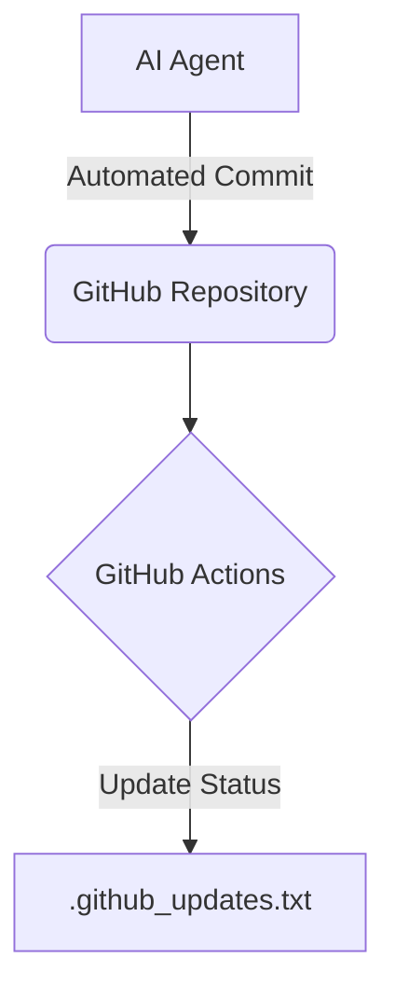

# 🤖 Claude Integration Workspace

A minimal repository used as a workspace for Claude AI and GitHub Actions integrations.

## 🏗 Architecture
This repository is primarily utilized for automated updates and CI/CD testing rather than hosting a standalone application.
- **Core File**: `.github_updates.txt` tracks automated pushes and integration statuses.
- **Pipeline**: Acts as a testing ground for automated AI commits.

## 🛠 Usage
No local setup is required. This repository is driven by external API calls and automated GitHub workflows.